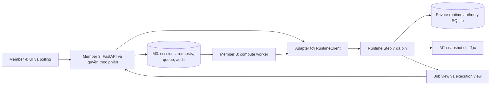

# Kế hoạch triển khai backend — Member 3

**Dự án:** SafeRoute VN  
**Người thực hiện:** Member 3 — Backend Engineer / System Integrator  
**Ngày lập:** 05/10/2026; các mốc làm việc dùng giờ Việt Nam, UTC+07:00.  
**Trạng thái:** Phần backend thuộc Member 3 hoàn tất ở app 0.8.0, gồm P0 và P1 comparison/autoplay/narrative/mock/launcher. 815 test đạt và native SDK mới đạt; frontend E2E/full-team G3 còn chờ mã và nghiệm thu M4. Xem [báo cáo hoàn tất](M3_COMPLETION_ACCEPTANCE_20261006.md).  
**Mục tiêu:** Cung cấp backend để Member 4 nạp kịch bản, chạy tối ưu bất đồng bộ, xem kết quả, chấp nhận kế hoạch, replay sự kiện và truy xuất lịch sử; dùng đúng runtime Step 7 của Member 2.

**Cập nhật thực hiện 05/10/2026 — MLAI4:** M3-01 `G0_TECHNICAL_PASS`, đầu vào `COMPLETE_VERIFIED` trên root `D:\MLAI4\Apex-SafeRouteVN\SafeRouteVN_Project_Structure_PLAN`. Runtime/venv/state riêng tại `D:\MLAI4\.local\m3-step7`. [Báo cáo bước 1](M3_STEP1_ACCEPTANCE_20261005.md) và [preflight JSON](M3_STEP1_PREFLIGHT_20261005.json) là bằng chứng hiện hành. M3-02 `M3_STEP2_FOUNDATION_PASS`: 57 test đạt và native HTTP/SDK pass. [Báo cáo M3-02](M3_STEP2_ACCEPTANCE_20261005.md), [handoff HTTP cho M4](M3_API_HANDOFF.md). M3-03 `M3_STEP3_SESSION_READ_PASS`: 79 test đạt; S0–S8 load/read qua HTTP/SDK, owner/retry/restart pass. [Báo cáo M3-03](M3_STEP3_ACCEPTANCE_20261005.md), [API load/read](M3_SESSION_API_HANDOFF.md). M3-04 `M3_STEP4_ASYNC_OPTIMIZE_PASS`, G1 đạt: 151 test đạt; native S0 tạo witness FEASIBLE/VALIDATED; submit/poll/cancel, worker riêng, singleton, retry/restart và forecast không đổi physical head pass. [Báo cáo M3-04](M3_STEP4_ACCEPTANCE_20261005.md), [API job](M3_JOB_API_HANDOFF.md). `/ready` đạt 200 khi API và worker cùng hoạt động; helper kiểm thử đã dừng. M3-05 M3_STEP5_ACCEPTANCE_PASS (P0): 202 test đạt; native accept S0, generation tăng đúng một, physical state giữ nguyên, receipt/audit/retry/restart pass. [Báo cáo M3-05](M3_STEP5_ACCEPTANCE_20261005.md), [API accept](M3_ACCEPT_API_HANDOFF.md). M3-06 `M3_STEP6_EVENT_REPLAY_PASS`: 281 test đạt (79 case mới); native S2/S3/S4 hoàn thành vòng accept → advance → event → replan → accept → advance, receipt/retry/history/reset/restart pass. [Báo cáo M3-06](M3_STEP6_ACCEPTANCE_20261005.md), [API event/replay](M3_EVENT_REPLAY_API_HANDOFF.md). M3-07 `M3_STEP7_OUTBOX_RECOVERY_ARTIFACT_PASS`: 503 test đạt; native outbox/ack/export/restart/backup/corruption đạt, không solver call mới. [Báo cáo M3-07](M3_STEP7_ACCEPTANCE_20261005.md), [handoff](M3_OUTBOX_RECOVERY_ARTIFACT_API_HANDOFF.md). G2 backend đạt; full frontend E2E/offline M3-08 và P1 comparison còn lại.

## 1. Cơ sở và hiện trạng

Nguồn đã đọc:

- [Tài liệu phân công TASK-03](../../../../MLAI/documents/chi_tiet_ke_hoach_tung_cong_viec.md) tại `D:\MLAI\documents\chi_tiet_ke_hoach_tung_cong_viec.md`.
- [M2_STEP7_HANDOFF_20261004.md](M2_STEP7_HANDOFF_20261004.md), đặc biệt mục 5–8.
- [step7_INTEGRATION_CROSSWALK.md](step7_INTEGRATION_CROSSWALK.md), [RUNTIME_INSTALL_README.md](RUNTIME_INSTALL_README.md), [receipt Step 7](STEP7_DELIVERY_RECEIPT_20261004.json).
- [API v1](task02_m2_m3m4_api_contract_v1.md), [runbook Member 1](member1_runbook.md), SDK và reference transport tại `optimization/runtime/`.
- `README.md` và `backend/README.md` về ownership.

Tài liệu phân công có 15 task và đều đánh dấu `[x] HOÀN THÀNH`. Tuy nhiên, bản dự án đang đọc chỉ có `backend/api`, `backend/models`, `backend/services` với `.gitkeep` và README; chưa thấy mã backend hay báo cáo test tương ứng. Vì vậy, kế hoạch này lấy trạng thái **chưa xác minh triển khai** làm điểm xuất phát. Nếu bạn có backend trong bản khác, nhập và kiểm tra bản đó trước để chỉ làm các phần còn thiếu.

Các kiểm tra ban đầu tại MLAI3 khi lập kế hoạch (lịch sử; kết quả hiện hành của MLAI4 nằm trong báo cáo bước 1 ở trên):

| Hạng mục | Kết quả ngày 05/10/2026 | Ý nghĩa |
| --- | --- | --- |
| Runtime ZIP | SHA-256 khớp receipt; 149 file | Có gói cài độc lập để dùng |
| Integration ZIP | SHA-256 khớp receipt; 182 file | Có gói kiểm tra contract riêng |
| 155 bản ghi trong upload map | 154 file khớp kích thước/hash; thiếu `shared/examples/S2_execution_view.json` | Cây team chưa đủ để checker chứng nhận toàn bộ |
| Example S2 trong hai ZIP | Có `examples/S2_execution_view.json` | Có thể kiểm S2 từ gói giải nén riêng |
| Node consumer | `PORTABLE_JS_PASS`, 13 cases | Xác nhận consumer portable; chưa xác nhận solver |
| Golden trên cây team | `GOLDEN_FAIL` vì thiếu example S2 | Cần bổ sung đúng byte hoặc dùng Integration ZIP |
| Reference flow S3 và S4 | `M3_RUNTIME_M4_REFERENCE_FLOW_PASS` | Xác nhận mapping reference, chưa phải frontend thật |
| M1 SQLite | Có network 378368000 bytes và features 1111019520 bytes | Chưa băm hai DB, chưa nghiệm thu source |
| Python | Lệnh `python` chưa có trên PATH của shell kiểm tra | Cần chọn executable Windows CPython 3.12 phù hợp; chưa chạy native runtime |

Đối chiếu upload map bằng PowerShell chỉ là kiểm file/hash phục vụ khảo sát; không thay thế `M2_STEP7_VERIFY_20261004.py`, kiểm production inventory, source gate hay attestation Windows.

## 2. Điều chỉnh TASK-03 theo bộ bàn giao hiện tại

| Giả định trong kế hoạch cũ | Cách triển khai cho Step 7 |
| --- | --- |
| Copy solver vào `backend/engine`, gọi OR-Tools trực tiếp | M3 gọi public `RuntimeClient`; mã M2 giữ tại `optimization/` trong package riêng |
| StateManager in-memory giữ trạng thái vật lý | Runtime authority store giữ trạng thái vật lý; M3 giữ phiên, quyền truy cập, request, hàng đợi và audit |
| S2 có 25 đơn/4 xe và sự kiện ngập | Suite đã pin: S2 bắt đầu 8 đơn/2 xe, thêm đơn gấp; S3 xe unavailable giữ hàng ONBOARD; S4 mưa giả lập. Đọc fixture thực tế, không hard-code demo cũ |
| HTTP trả ngay ba phương án sau 3 giây | `submit → worker compute → polling`; mặc định BALANCED. Ba profile là các job riêng; chỉ so sánh khi SDK báo `COMPARABLE` |
| Toàn bộ wire dùng km/h theo WBS | API v1 và supplemental wire giữ đơn vị đã khóa: m, s, kg, VND; observed/action có µs. UI có thể đổi sang km/giờ để hiển thị |
| `/events` nhận edge/severity tùy ý | MVP chỉ áp dụng pending event đã xác thực của suite bằng ID và đúng barrier thời gian |
| Accept hoặc tính xong đồng nghĩa đã giao | Compute là forecast; accept là kích hoạt; delivered chỉ tăng từ observed replay qua `advance` |
| Reset sửa trạng thái phiên về đầu | Reset tạo phiên mới từ cùng fixture; giữ lịch sử phiên cũ và không rewind physical head |
| Timeout trả mock hoặc tự thay solver/ma trận | Giữ diagnostic `SEARCH_LIMIT`/`TIME_LIMIT` hoặc failure thực tế; mock là môi trường demo riêng, không ghi vào authority thật |
| Đồng nhất JSON hai lần optimize từng byte | So sánh kết quả nghiệp vụ đã chuẩn hóa với cùng input/build/config; tách job ID, request ID và telemetry thay đổi. Retry cùng command phải trả receipt cũ |

Giữ API v1 frozen và các contract bổ sung: SDK/1, command/response/1, job-view/1, execution-view/2. Số `/2` của execution view không đổi tên toàn bộ API v1 thành v2. Không ép trajectory động có reload/mid-edge/return-only thành static v1 plan.

## 3. Phạm vi bạn chịu trách nhiệm

**P0 cần hoàn thành:** FastAPI, validation HTTP, cấu hình server, xác thực và quyền theo phiên, adapter SDK, worker bất đồng bộ, idempotency bền vững, đọc trạng thái, accept, event/replay, recovery, outbox, audit/export và kiểm thử tích hợp.

**P1 sau khi luồng chính ổn định:** so sánh ba profile, điều khiển tốc độ replay, narrative hiển thị, launcher tiện dụng. Endpoint thêm đơn tùy ý cần event contract/version được M1/M2/Leader chốt; Step 7 không có public command để nhận một order bất kỳ.

M1 cung cấp snapshot/catalog/geometry và source metadata. M2 cung cấp solver, validator, runtime/store semantics, profile config và contracts. M4 xây giao diện, bản đồ, KPI, driver view. Bạn tích hợp các đầu vào này và giữ ranh giới HTTP/server, không xây lại solver hoặc state vật lý của M2.

Mã mới chủ yếu nằm trong `backend/`; tài liệu bàn giao trong `docs/`. Thay đổi `shared/`, `configs/` hoặc phần của thành viên khác cần phối hợp theo ownership. Trong MVP, không đổi weights/caps, schema hoặc inventory của gói Step 7.

## 4. Kiến trúc đề xuất



Chọn MVP chạy trên một máy Windows: FastAPI và một compute worker tách tiến trình; M3 metadata dùng SQLite riêng. Chưa cần Redis/Celery nếu chưa có nhu cầu nhiều máy. Hàng đợi phải lưu trên đĩa; không chỉ dùng task nền trong tiến trình HTTP.

Adapter/bridge của M3 gọi SDK trong environment của runtime và có thể phục vụ các lệnh đọc/accept/cancel khi compute đang chạy. Bridge là mã M3 nằm ngoài root package đã pin. Interpreter, thư mục runtime, snapshot và store là cấu hình server; xác minh module thực sự được import từ package đã cài. Không import nhầm `optimization` của cây team đang thay đổi.

MVP có một compute worker xử lý tuần tự; đảm bảo các mutation không bị một khóa toàn phiên giữ suốt thời gian giải. Runtime chịu trách nhiệm lease/fencing/CAS; M3 không tự viết vào bảng authority hoặc import `Store`, planner hay worker internals. Chỉ mở rộng concurrency sau khi đã kiểm cancel, stale job và recovery.

Cấu trúc mã M3 dự kiến:

```text
backend/
  api/main.py, dependencies.py, errors.py
  api/routers/{system,scenarios,sessions,jobs,plans,events,replay,artifacts}.py
  models/{http_requests,http_responses}.py
  services/{settings,runtime_gateway,runtime_bridge,session_service}.py
  services/{request_repository,job_dispatcher,compute_worker}.py
  services/{replay_service,outbox_service,audit_service,artifact_exporter}.py
  tests/                         # contract, HTTP, persistence, native integration
  scripts/{preflight,start_backend,start_worker}.ps1
  requirements-backend.lock.txt
  .env.example                   # tên biến và giá trị mẫu; không chứa token thật
docs/
  M3_API_HANDOFF.md, M3_NATIVE_TEST_REPORT.md, M3_OPERATIONS_RUNBOOK.md
```

Đây là cấu trúc mục tiêu. M3-02–05 đã có app/router HTTP, models, auth/session metadata, readiness, catalog/session/job/plan services, durable queue, worker riêng, acceptance audit, gateway/bridge và tests. Launcher dùng `.py` để chạy trên PowerShell hiện tại mà không đổi ExecutionPolicy; event/replay/artifacts sẽ bổ sung ở các bước sau.

## 5. Thứ tự công việc và tiêu chí hoàn thành

### M3-01 — Tiếp nhận và kiểm môi trường, package, source (P0; 2–4 giờ, chưa tính cài đặt)

**Kết quả hiện hành MLAI4:** G0_TECHNICAL_PASS; đầu vào COMPLETE_VERIFIED. Xem báo cáo bước 1.

1. Xác định có backend riêng cần tái sử dụng hay không; kiểm thay vì kế thừa dấu `[x]` trong WBS.
2. Ghi executable Python 3.12, kiến trúc/ABI và phiên bản dependency. Dùng environment Windows được phép; không mặc nhiên dùng `.venv` của M1.
3. Kiểm ZIP/hash theo receipt; giải nén Runtime ZIP vào root local mới ngoài cây team, cài theo `requirements-runtime.lock.txt`. Dependency backend có lock riêng để tránh thay thư viện native của runtime.
4. Chọn `snapshot_root` là **root chứa thư mục `scenarios/`**, ví dụ root dự án tải về; không trỏ trực tiếp vào `member1-tdbt-v1`. Runtime tìm `<snapshot_root>/scenarios/cached_context/hcmc/member1-tdbt-v1`.
5. Kiểm catalog/fixtures và actual SHA-256 hai DB; đảm bảo source chỉ đọc, không có WAL/SHM/journal. Tạo parent/store private mới ngoài Drive sync và ngoài install root.
6. Giải nén Integration ZIP riêng để chạy consumer/corpus/v1 tests. Ghi thiếu example S2 của cây team; phối hợp bổ sung đúng file, không tự sửa bản S2 mới.
7. Ghi build/environment/source receipt vào báo cáo. Việc Leader chốt package/build/environment là điều kiện triển khai được nêu trong handoff; kế hoạch này không suy ra receipt đã được duyệt chỉ từ nhãn READY.

**Đầu ra:** cấu hình installation, báo cáo preflight, đường dẫn package/source/store, danh sách việc phụ thuộc M1/M2/Leader.  
**DoD/G0:** build và dependency đúng; source gate đạt; bootstrap và resolve một phiên thật thành công. Portable PASS riêng chưa đủ G0. Nếu môi trường bị Application Control chặn, ghi đúng BLOCKED của môi trường đó và tiếp tục phần HTTP/contract bằng fixture, không coi fixture là native pass.

### M3-02 — Khung FastAPI và contract HTTP (P0; 3–4 giờ)

**Kết quả thực hiện:** M3_STEP2_FOUNDATION_PASS. 57 test đạt; HTTP/socket và SDK thật pass. Readiness chờ worker M3-04. Xem [báo cáo M3-02](M3_STEP2_ACCEPTANCE_20261005.md).

1. Tạo app, router, `/health`, `/ready`, Swagger; thêm request ID và lỗi JSON thống nhất có `code`, `path`, `message`.
2. Cấu hình CORS theo origin frontend cụ thể. Dùng cấu hình xác thực phù hợp demo và kiểm quyền phiên trước mọi thao tác; actor trong audit lấy từ server identity.
3. Tạo HTTP request models chỉ nhận scenario/profile/job/event ID và revision mong đợi. Từ chối path, source/build digest, routes, state/load tự khai và field không hỗ trợ.
4. Validate body JSON nghiêm ngặt ở biên nhận, trước khi dùng decoder làm mất duplicate keys; từ chối nonfinite/unsafe integers theo contract. Giữ exact integer strings, rational và `null` khi trả view.
5. Bọc response HTTP quanh typed runtime view; ghi rõ schema version. Không đưa raw job/store records ra browser.

**Đầu ra:** app chạy, OpenAPI và ví dụ payload để M4 bắt đầu adapter.  
**DoD:** health 200; ready chỉ 200 khi G0/worker sẵn sàng; request sai trả diagnostic có cấu trúc; request không có quyền bị chặn; preflight frontend hoạt động.

### M3-03 — Catalog, phiên và read API (P0; 2–3 giờ)

**Kết quả thực hiện:** M3_STEP3_SESSION_READ_PASS. 79 test đạt; native HTTP S0–S8, hai phiên S0, owner/retry/restart pass. Xem [báo cáo M3-03](M3_STEP3_ACCEPTANCE_20261005.md).

1. Đọc catalog đã pin một lần khi khởi tạo; expose danh sách scenario và metadata/version thực tế.
2. Mỗi lần load tạo `session_id` server quản lý, persist owner/scenario/install identity và bootstrap bằng SDK.
3. Lấy basis/head qua `resolve`/`get_head`; read state/vehicles từ validated execution view. Orders/locations có thể dùng projection đọc từ fixture đã xác thực và head, nhưng không tạo authority thứ hai.
4. Resolve lại trước mutation mới; retry request cũ dùng binding đã lưu. Revision browser chỉ dùng kiểm xung đột với server, không làm trust anchor.

**Đầu ra:** nạp S0–S8, phiên độc lập, GET state/vehicles/orders/locations.  
**DoD:** cùng scenario có hai phiên không lẫn trạng thái; phiên khác owner không đọc được; số đơn/xe đúng fixture; view chưa có observation giữ `observed_metrics=null`.

### M3-04 — Optimize, durable queue và compute worker (P0; 5–7 giờ)

**Kết quả thực hiện:** M3_STEP4_ASYNC_OPTIMIZE_PASS; G1 đạt. 151 test đạt và native HTTP + worker pass; S0 COMPLETED/FEASIBLE với witness VALIDATED, cancel queued/running và retry/restart pass. Xem [báo cáo M3-04](M3_STEP4_ACCEPTANCE_20261005.md). Worker giữ singleton lock đến khi compute/recovery kết thúc, có heartbeat trong lúc solve và recovery qua public SDK cho các claim mồ côi. Không tự chạy lại job FAILED hoặc đổi binding/budget của request cũ.

1. HTTP nhận request ID/idempotency key; atomically lưu canonical request digest, actor/session, resolved basis, runtime command ID và trạng thái xử lý.
2. Gọi `submit`, lưu opaque job ID, enqueue durable compute và trả HTTP 202 cùng URL polling. MVP chọn BALANCED; budget từ cấu hình server trong giới hạn SDK, không quảng bá SLA 30 giây.
3. Worker gọi public `command("compute", ...)`; runtime tự quản lý subprocess/validator native. HTTP thread không chờ hết solver budget.
4. Poll bằng `job_view`; phân biệt `job_status` với `business_status`/`internal_status`. `COMPLETED` vẫn có thể là SEARCH_LIMIT; `FAILED` không có quyết định hợp lệ để accept.
5. Retry cùng key/cùng nội dung trả bản ghi cũ; key khác nội dung trả 409. Sau crash giữa runtime commit và M3 lưu response, đối soát bằng **cùng command ID và binding cũ**, không tạo mutation mới.
6. Thêm cancel; worker cũ/stale/cancelled không publish làm thay đổi head. Không tự retry vô hạn hoặc thay budget dưới cùng idempotency key.

**Đầu ra:** submit/poll/cancel hoàn chỉnh và worker riêng.  
**DoD/G1:** một native job hoàn tất; polling vẫn hoạt động khi compute; optimize không làm tăng delivered hoặc thay head; restart không mất request/job mapping; duplicate concurrent request không tạo hai job.

### M3-05 — Accept và luồng nhiều profile (P0; 2–3 giờ, so sánh profile P1)

**Kết quả P0:** M3_STEP5_ACCEPTANCE_PASS. 202 test đạt; native S0 compute → accept, gen 0→1, job active, physical head/time/vehicles/delivered/observed metrics giữ nguyên. Retry và API/worker restart giữ receipt, state và đúng một audit. Request mới kiểm full basis/certified witness, CAS của SDK chặn race; request cũ dùng command/basis đã lưu trước mọi stale check mới. Response tách receipt lịch sử với execution view hiện tại. Xem [báo cáo M3-05](M3_STEP5_ACCEPTANCE_20261005.md), [API accept](M3_ACCEPT_API_HANDOFF.md). **P1 đã bổ sung ở 0.8.0**; số liệu đoạn này là nghiệm thu P0 lịch sử; G2 replay core đã kiểm tại M3-06; G2 backend đã chốt tại M3-07; full frontend E2E/offline còn M3-08.

1. Map opaque plan handle sang certified job trong persistence; không nhận plan JSON từ UI.
2. Kiểm quyền, latest basis và trạng thái validated job, rồi gọi `accept`. Job dựa vào head cũ phải báo conflict; không tự gắn job cũ vào basis mới.
3. Lưu audit/receipt; resolve view mới sau commit. Accept không tự chuyển toàn bộ planned orders sang DELIVERED.
4. Với ba profile, submit các job từ cùng persisted basis. Chỉ đưa ra bảng trade-off khi `compare_profiles` báo `COMPARABLE` — cùng basis chưa đủ nếu physical domain khác nhau.

**Đầu ra:** accept API và trạng thái active job.  
**DoD:** accept đúng job hợp lệ; job stale/no-witness bị từ chối; retry accept không commit hai lần; delivered prefix giữ nguyên tại thời điểm accept. P1 đạt khi bảng so sánh xử lý được cả NON_COMPARABLE và profile thiếu witness.

### M3-06 — Event và replay theo đồng hồ mô phỏng (P0; 4–6 giờ)

**Kết quả:** `M3_STEP6_EVENT_REPLAY_PASS`; 281 test đạt, gồm 79 case mới. Native HTTP/SDK S2/S3/S4 đã chạy fresh witness trước/sau event; barrier, exactly-once, observed prefix/custody/overlay, pause/reset và restart đạt. Manual STEP mặc định 60 giây; không có autoplay. Receipt/audit atomic, retry dùng full basis/target/command cũ; execution view đọc mới. [Báo cáo](M3_STEP6_ACCEPTANCE_20261005.md), [handoff](M3_EVENT_REPLAY_API_HANDOFF.md). G2 replay core đạt; G2 backend đã chốt tại M3-07; full frontend E2E/offline còn M3-08.

1. Đọc pending event/timestamp từ source/session server; điều khiển `advance` tới barrier bằng latest basis.
2. Gọi `apply_event` với đúng pending ID sau khi có accepted replay; không vượt qua event chưa áp dụng. Persist command ID để xử lý exactly-once.
3. Sau event, resolve basis mới, submit replan, polling, accept và advance tiếp. UI thể hiện khoảng đang tính/chưa có active suffix theo view thực tế.
4. Test S2 thêm đơn, S3 unavailable giữ custody, S4 overlay mưa. Vị trí/load/range/delivered lấy từ runtime; không tự nội suy GPS bằng vận tốc mẫu.
5. MVP có step và pause. Start/tốc độ x1/x5/x10 chỉ lập lịch các lần advance hợp lệ. Reset tạo session mới; lịch sử cũ vẫn truy xuất được.

**Đầu ra:** event/replay controller, event log và view cập nhật.  
**DoD/G2:** hoàn thành một vòng `bootstrap → submit/compute → accept → advance → apply_event → replan → accept → advance`; S2 không nhân đôi order; S3 không chuyển hàng sang xe khác; S4 đổi đúng overlay; completed prefix không bị viết lại. Luôn gắn `SIMULATED_REPLAY`, `real_world_observation=false`.

### M3-07 — Outbox, phục hồi và audit/artifacts (P0; 3–5 giờ)

**Kết quả thực hiện:** `M3_STEP7_OUTBOX_RECOVERY_ARTIFACT_PASS`; 503 test đạt và native public SDK/HTTP outbox/ack/export/restart/backup/corruption đạt. Gate ghi chỉ mở sau validation/outbox/queue/request reconcile. G2 backend đạt; full M3-08 E2E/offline còn lại. [Báo cáo](M3_STEP7_ACCEPTANCE_20261005.md), [handoff/runbook](M3_OUTBOX_RECOVERY_ARTIFACT_API_HANDOFF.md). Historical evidence chưa lưu được ghi rõ trong export, không dựng lại.

1. Poll `read_notifications`; lưu notification và dedup event ID trước khi `acknowledge`. Retry ack không gây pickup/delivery lần hai.
2. Recovery do server startup/admin điều phối, không để browser gọi tùy ý. Fencing orphan worker; kiểm `validate_session` và đối soát durable queue trước khi nhận mutation mới.
3. Nếu STORE_INVALID/source mismatch, giữ bằng chứng, chặn mutation và báo diagnostic; không reset SQLite để tiếp tục như một phiên thành công.
4. Audit lưu actor/request ID/command ID/session/job/event, basis trước/sau, wall-clock timestamp và simulation timestamp riêng, outcome/diagnostic.
5. Export manifest, requests, job views, accepted trajectory, event log, execution frames, notifications và test metadata. Export từ record đã commit, giữ historical hashes; không giả lập `reoptimized_plan` khi job chưa có witness.
6. Backup chỉ qua public SDK/admin flow tới server path mới. Upgrade/rollback dùng quy trình M2/Leader và fence workers; không thay file trực tiếp trong runtime đang chạy.

**Đầu ra:** audit bundle, recovery checklist và backup procedure.  
**DoD:** restart sau accept giữ cùng head; crash sau lưu notification/trước ack không nhân đôi; export đủ lineage và nhãn proxy; store hỏng được báo chính xác.

### M3-08 — Kiểm thử, bàn giao M4 và đóng gói (P0; 7–10 giờ)

**Kết quả phần backend 06/10/2026:** `M3_STEP8_BACKEND_RELEASE_CANDIDATE_PASS`, 555 tests; fresh native offline S2/S3/S4 +same-basis S0, two fresh wheel-only installs và coordinated launcher đạt. 11 tiêu chí gồm 8 PASS, 2 scoped PASS và 1 N/A backend. G3 backend RC đạt; full frontend/browser E2E và G3 toàn nhóm chờ M4. [Báo cáo](M3_STEP8_ACCEPTANCE_20261006.md), [matrix](M3_STEP8_CRITERIA_MATRIX.md), [runbook](M3_OPERATIONS_RUNBOOK.md), [M4 checklist](M3_M4_E2E_CHECKLIST.md). Đây là kết quả 0.7.0 lịch sử; P1/autoplay/narrative được nghiệm thu bổ sung tại 0.8.0. OS air-gap chứng nhận và các giới hạn runtime vẫn giữ nguyên.


1. Chạy bộ 11 tiêu chí ở mục 8 và các test HTTP/persistence/concurrency. Native test phải gọi runtime thật trên source đã pin.
2. Với M4, diễn tập S2/S3/S4, loading/error/cancel/conflict, null metrics, observed/forecast và reload/return geometry. M4 chạy corpus từ Integration ZIP đủ example.
3. Viết `M3_API_HANDOFF.md`: routes, payloads, schema version, trạng thái, polling/backoff, lỗi và cách lấy auth token theo môi trường demo.
4. Viết runbook cài/chạy API và worker, reset phiên, backup/recover, offline demo, thông tin build/source/environment. Pin dependency backend riêng; launcher không cài package hoặc mở trình duyệt lại ở mỗi request.
5. Ghi kết quả PASS/FAIL/BLOCKED thực tế; tách portable, native integration, frontend E2E và performance. Không kế thừa số test PASS trong WBS cũ.

**Đầu ra:** backend release candidate, handoff API, native report, E2E biên bản và operations runbook.  
**DoD/G3:** luồng thật qua HTTP chạy offline với dữ liệu cài sẵn, restart/retry an toàn, M4 dùng được typed views; limitations được giữ đúng receipt. G3 không thay thế đánh giá E4 hoặc production calibration của toàn nhóm.

## 6. API HTTP đề xuất để chốt với Member 4

Các route dưới đây là API M3 bao quanh public SDK M2. State/job/accept/event/replay/notifications/artifacts đã thực hiện; comparison, autoplay/speed và narrative đã bổ sung ở 0.8.0; xem handoff hoàn tất và OpenAPI 06/10. Bắt đầu với API tối thiểu này; namespace `/api/runtime/` giúp phân biệt supplemental contracts với API v1 frozen. Mọi route có phiên đều kiểm owner/role và nhận idempotency key cho mutation.

| Route | SDK / nguồn | Response chính |
| --- | --- | --- |
| `GET /health`, `GET /ready` | app / installation readiness | liveness, readiness và diagnostic |
| `GET /api/runtime/capabilities` | command capabilities | khả năng và nhãn mô phỏng, không tự chứng nhận release |
| `GET /api/scenarios` | catalog đã xác thực | S0–S8 và metadata |
| `POST /api/scenarios/{id}/load` | bootstrap | session ID, basis và link execution view |
| `GET /api/sessions/{sid}/state` | resolve/get_head | execution-view/2 |
| `GET /api/sessions/{sid}/orders`, `/vehicles`, `/locations` | authenticated read projection | dữ liệu có session/version, không phải authority mới |
| `POST /api/sessions/{sid}/optimize` | submit + durable enqueue | 202, job ID và polling URL |
| `GET /api/sessions/{sid}/jobs/{jid}` | job_view | job-view/1; lifecycle và business outcome riêng |
| `POST /api/sessions/{sid}/jobs/{jid}/cancel` | cancel | receipt và job view |
| `POST /api/sessions/{sid}/jobs/{jid}/accept` | persisted handle → accept | receipt và execution view mới |
| `GET /api/sessions/{sid}/events` | verified source/session | pending metadata và apply_allowed |
| `POST /api/sessions/{sid}/events/{eid}/apply` | apply_event | receipt và link view mới |
| `POST /api/sessions/{sid}/replay/step` | advance tới mốc server kiểm tra | observed view; không vượt event barrier |
| `GET /api/sessions/{sid}/replay` | manual STEP controller | mode/step_seconds và current view |
| `POST /api/sessions/{sid}/replay/pause` | manual STEP controller | acknowledgement không đổi SDK head |
| `GET /api/sessions/{sid}/replay/history` | metadata audit | 100 receipt gần nhất |
| `POST /api/sessions/{sid}/replay/reset` | bootstrap phiên mới | session ID mới, giữ audit cũ |
| `GET /api/sessions/{sid}/notifications` | M3 durable inbox từ public SDK outbox | summaries, ack status và canonical cursor |
| `POST /api/sessions/{sid}/artifacts` | committed metadata + public SDK views | immutable bundle manifest, request_id retry |
| `GET /api/sessions/{sid}/artifacts`, `/{artifact_id}`, `/{artifact_id}/content` | M3 immutable bytes | list/manifest/exact UTF-8 content + SHA-256 theo owner |
| `POST /api/sessions/{sid}/profiles/compare` (P1) | compare_profiles | COMPARABLE hoặc NON_COMPARABLE |

M4 lấy `planned_suffix_metrics` và `projected_whole_metrics` từ runtime view; không tính lại load/head/hash từ UI. `accepted_trajectory` là forecast đã kích hoạt. Nếu cần preview geometry trước accept mà job-view hiện chưa cung cấp, phối hợp M2 bổ sung public projection có version; không expose raw internal job result để lấp khoảng trống.

Lỗi HTTP do M3 xác thực/shape: 401/403/422; idempotency/stale head/event barrier conflict: 409; installation/source/store không sẵn sàng: 503 với diagnostic gốc. Outcome SEARCH_LIMIT/TIME_LIMIT thuộc job đã đọc thành công: HTTP 200 cho GET job, giữ `plan_available=false`, không biến thành lỗi 500 hay chứng minh infeasible.

Nếu giữ các alias cũ `/optimize`, `/events`, `/decision-state`, phải ghi rõ session routing và version của response; tránh duy trì hai cách quản lý state. `POST /orders` tùy ý không nằm trong P0 Step 7; UI thêm đơn dùng event S2 đã pin hoặc đợi public event contract mới.

## 7. Lịch làm việc từ 05/10 đến 10/10

Ước lượng tổng khoảng **28–42 giờ triển khai/kiểm thử**, chưa tính thời gian cài môi trường, xử lý source lỗi hay chờ phối hợp. Mốc lõi 08/10 12:00 trong WBS là mục tiêu có điều kiện, cần khoảng 8–12 giờ tập trung/ngày từ điểm xuất phát này. Khi thiếu nguồn hoặc môi trường, ghi ảnh hưởng vào báo cáo tiến độ; không đổi nhãn mock thành integrated để giữ deadline.

| Ngày / mốc | Việc ưu tiên | Bằng chứng cuối mốc |
| --- | --- | --- |
| 05/10 | M3-01, M3-02; bắt đầu M3-03 | G0, app/OpenAPI, quyết định installation; M4 có payload mẫu |
| 06/10 | Hoàn tất M3-03/M3-04, bắt đầu M3-05 | G1; HTTP 202/poll/cancel, duplicate/restart không mất mapping |
| 07/10 | Hoàn tất accept, M3-06/M3-07 | G2; event/replan/replay, audit/outbox và recovery smoke |
| 08/10 trước 12:00 | Chạy acceptance lõi và sửa lỗi P0 | G3 backend nếu môi trường/source đã đạt; báo cáo kết quả thật |
| 08/10 chiều – 09/10 | M3-08 cùng M4; ba profile nếu đủ thời gian | E2E S2/S3/S4, lỗi/loading/null, runbook |
| 10/10 trước 18:00 | Đóng gói, offline rehearsal, backup và handoff | Release candidate, biên bản bàn giao và danh sách hạn chế |
| 11–14/10, nếu nhóm giữ mốc 15/10 | Dự phòng lỗi tích hợp; không mở rộng scope | Chỉ fix có regression và package/version được quản lý |

WBS đề cập cả đóng gói 10/10 và freeze 15/10: kế hoạch này dùng 10/10 cho release candidate, 15/10 cho freeze cuối theo nhóm; Leader cần thống nhất mốc khi chốt tiến độ.

Nếu G0 chưa đạt cuối 05/10 hoặc G1 chưa đạt cuối 06/10, báo ngay phần phụ thuộc và điều chỉnh phạm vi: giữ một profile BALANCED, replay step, polling và audit tối thiểu; chuyển multi-profile, auto replay và CRUD tùy ý sang sau. Native core vẫn phải đạt mới tuyên bố tích hợp.

## 8. Nghiệm thu và cách kiểm chứng

### 8.1. Giữ 11 tiêu chí TASK-03, kiểm theo semantics Step 7

| # | Tiêu chí | Kiểm thực tế |
| --- | --- | --- |
| 1 | Completed stops không đổi | So historical observed prefix trước/sau event, replan và accept |
| 2 | Đơn không bị phục vụ trùng | Delivered prefix/planned suffix/unserved là partition đúng của universe; retry event/pickup/delivery không thêm bản trùng |
| 3 | Capacity đúng | Load theo action/observed frame không vượt capacity của fixture, khớp hàng ONBOARD; không hard-code 30 kg cho mọi suite |
| 4 | Time windows đúng | Dùng independent runtime validator; không chỉ tin arrival được HTTP serialize |
| 5 | Ca làm việc đúng | Kiểm cả return/reload/continuation bằng validator, không chỉ stop giao cuối |
| 6 | Có thể tái lập | Cùng pinned source/basis/build/config và điều kiện solve đã ghi: so semantic result; replay/retry cùng receipt khớp, tách telemetry/ID |
| 7 | ONBOARD giữ owner | S3 vehicle unavailable không chuyển hàng sang xe khác |
| 8 | Xe không teleport | Replan bắt đầu từ observed node/edge progress; load/range/position được runtime validate |
| 9 | Narrative khớp JSON | Nếu có narrative, số liệu lấy từ validated metric đúng scope và đổi đơn vị có kiểm tra |
| 10 | Safety là PROXY | Nhãn và export giữ relative exposure proxy; không đổi thành xác suất tai nạn |
| 11 | Offline | Ngăn truy cập dịch vụ ngoài khi test, dùng snapshot/package đã cài; luồng HTTP + worker + replay vẫn chạy |

SEARCH_LIMIT không có witness không được gán các order là infeasible. Acceptance partition chỉ khẳng định theo view/witness đã chứng nhận; giữ `coverage_evaluated=false` khi chưa đánh giá được.

### 8.2. Các bài test bổ sung bắt buộc cho backend

- Hai request đồng thời cùng key; cùng key khác nội dung; retry sau crash giữa runtime commit và persist response.
- Accept job stale; event sai phiên/sai ID/chưa tới barrier; advance vượt event; reset không rewind phiên cũ.
- Compute không thay physical head; cancel trong khi chạy; worker cũ bị fence; HTTP vẫn đọc/poll khi solver chạy.
- Restart sau accept/advance; notification lưu rồi chưa ack; authority corruption/source thay hash được báo và giữ chứng cứ.
- Truy cập phiên khác owner; body chứa path/build/source/state giả; duplicate JSON keys, nonfinite, exact integer strings và null semantics.
- Ba profile khác physical domain báo NON_COMPARABLE; GET job outcome no-witness vẫn thành công về transport.

Chạy test nhẹ với fixture cho HTTP, schema và persistence; chạy native integration riêng với runtime/source thật và output directory mới. Không áp mục tiêu toàn bộ native suite dưới 30 giây khi runtime đã công bố performance NOT_MET.

### 8.3. Lệnh tiếp nhận tham khảo

Các lệnh sau dành cho lúc triển khai; chưa chạy Python/native trong lần lập kế hoạch. Thay executable/path mẫu bằng cấu hình installation đã chọn.

```powershell
# Từ root team, sau khi đã bổ sung đầy đủ file đúng byte:
& $RuntimePython docs/M2_STEP7_VERIFY_20261004.py --project-root $TeamRoot

# Từ root dự án M1/team chứa scenarios/, bằng environment M1 phù hợp:
& $M1Python -m geo_data.cli verify-scenarios --scenarios-root scenarios --suite-id thu-duc-binh-thanh-v1

# Trong thư mục Integration ZIP đã giải nén đủ 182 file:
& $RuntimePython -m optimization.runtime.portable_tests --view examples/S2_execution_view.json --view examples/S3_execution_view.json --view examples/S4_execution_view.json
node optimization/runtime/consumer_test.mjs
node optimization/runtime/consumer_golden.mjs examples
& $RuntimePython -m pytest -q -p no:cacheprovider shared/contracts/test_task02_api_v1_portable.py

# Trong Runtime ZIP đã giải nén đủ 149 file; output mới cho mỗi lần chạy:
& $RuntimePython -m optimization.runtime.rolling_flow --snapshot-root $M1SnapshotRoot --output-root $NewRunDirectory --scenario-id S8 --budget-seconds 120 --all-profiles --expected-build-sha256 $ApprovedBuildSha
```

Chạy các biến thể `python -O` theo crosswalk và dùng output mới. Portable expected: JS 13 cases, golden 60; runtime byte checker expected 149 entries/141 production pins. Kết quả này vẫn tách với native acceptance, E2E và benchmark.

Giá trị tham chiếu từ receipt/handoff để cấu hình **server**:

| Pin | Giá trị |
| --- | --- |
| Build | `80694f511dc735d0b6a1a0a830edd7f6267df395e87dad0ccf180914b49d5a41` |
| Runtime ZIP SHA-256 | `d5345e75db2b41914cf4d0ed96a83e50e9c251637065ae1264eb1f33f41cbe4e` |
| Integration ZIP SHA-256 | `d59917dded655398a04f3856d1ae73c658cc3dec3002a3467fb24e8d4a45b5e7` |
| Contract lock SHA-256 | `c48234f5ba6b895d9cc4723c1b95b2105c48624b16b332bbe203111cd4b6184d` |
| network.sqlite SHA-256 | `d4f2412884d7809cba79f86b65f6677c025ebf3e0ead357d3fc3f9cea553a204` |
| features.sqlite SHA-256 | `8870d537c4f3eb3dca07a177951c66abfe204fe61039852109b92f4751981469` |

Không dùng field browser để chọn pin hoặc ghi đè config này. Epoch fixture giữ nguyên theo catalog; wall clock ngày 05/10 không thay simulation epoch của suite.

## 9. Đối chiếu đầy đủ 15 task gốc

| TASK-03 | Phần tương ứng trong kế hoạch này | Cách nghiệm thu |
| --- | --- | --- |
| .01 Contracts | M3-02; giữ frozen contracts và HTTP models riêng | Schema/corpus pass, không sửa wire đã pin |
| .02 FastAPI | M3-02 | Health/ready/CORS/auth/error |
| .03 Mock | M3-02/M3-08 | Fixture typed view riêng, có nhãn demo; không commit authority |
| .04 Scenario loader | M3-01/M3-03 | Catalog/source gate và bootstrap |
| .05 State manager | M3-03/M3-07 | Session/binding của M3; physical state do runtime authority giữ |
| .06 CRUD | M3-03/M3-06 | Read projection; create dynamic order theo public event đã hỗ trợ |
| .07 Geo/context adapter | M3-01/M3-03 | Source pin, geometry/unit đúng; matrix thuộc runtime M2 |
| .08 Optimize | M3-04/M3-05 | Async job, witness, lifecycle; multi-profile có comparability |
| .09 Events | M3-06 | Pending event đúng barrier, exactly-once, context overlay |
| .10 Accept | M3-05 | Certified job/latest basis, atomic CAS và audit |
| .11 Replay | M3-06 | Observed prefix, không rewind/teleport, reset phiên mới |
| .12 Artifacts | M3-07 | Manifest/lineage/log/metrics scope và hashes |
| .13 11 tests | M3-08, mục 8 | Báo cáo thật, phân portable/native |
| .14 Frontend E2E | M3-08 cùng M4 | S2/S3/S4 qua HTTP, lỗi/null/forecast được hiển thị đúng |
| .15 Packaging/fallback | M3-08 | Lock/config/runbook/offline rehearsal; không thay runtime bằng mock khi lỗi |

## 10. Phối hợp và checklist bắt đầu

| Người | Đầu vào cần chốt | Bạn bàn giao lại |
| --- | --- | --- |
| Member 1 | Đúng snapshot root, catalog S0–S8, source manifests/hashes, geometry và event timestamp | Kết quả source gate, session/replay integration, diagnostic thiếu dữ liệu |
| Member 2 | Package/build/SDK lock, validator behavior, budget/no-witness, event/recovery/upgrade semantics | Native reproduction/report; yêu cầu public preview projection nếu M4 cần |
| Member 4 | Routes/payloads, session/auth, polling, unit/scope/null/lifecycle mapping | OpenAPI, example đã pin, API handoff và E2E checklist |
| Leader | Chốt receipt/install environment, ownership changes và freeze | G0–G3 evidence, phụ thuộc và giới hạn còn lại |

Checklist để bắt đầu ngay:

- [x] Kiểm backend riêng; đã tìm thấy bản cũ tại `D:\MLAI`, chưa tích hợp SDK Step 7.
- [x] Chọn runtime ZIP, Python 3.12 và root thực thi riêng; xác định root snapshot chứa `scenarios/`.
- [x] Kiểm source hashes/gate và bootstrap thật; ghi `G0_TECHNICAL_PASS` và review deployment pending.
- [x] M3-02: FastAPI/contract/auth/CORS/gateway capabilities; đã bàn giao OpenAPI cho M4.
- [x] M3-03: read/load API, bootstrap/resolve và owner phiên thực tế; S0–S8/independence/retry/restart pass.
- [x] M3-04: optimize BALANCED bất đồng bộ + durable queue/idempotency; G1 đạt bằng native witness, polling, cancel và restart.
- [x] M3-05 P0: accept certified job, receipt/audit/retry/CAS và native activation không tăng delivered.
- [x] M3-05 P1: durable batch ba profile/existing jobs; SDK COMPARABLE/NON_COMPARABLE, thiếu witness, cancel/retry/restart và CAS cleanup.
- [x] P1 replay: start/speed 1/2/4/8/pause, tick atomically, restart fencing, barrier/final return.
- [x] Narrative current/forecast và trade-off historical; export /2 đủ lịch sử comparison/playback, giữ /1 nguyên byte.
- [x] Mock backend riêng read-only S2/S3/S4, asset pin và token riêng; launcher native/offline đã bàn giao.
- [x] M3-06: event/replay step, pause/reset/history; native S2/S3/S4 và G2 replay core đạt.
- [x] M3-07: durable outbox/dedup/ack, gated recovery và artifacts; native/restart/backup đạt, G2 backend đạt.
- [x] M3-08 phần backend: 555 tests, matrix 11 tiêu chí có scope/N/A, fresh native offline, release/wheel-only install, launcher/runbook và M4 checklist. G3_BACKEND_RC_PASS.
- [ ] M3-08 frontend/browser E2E cùng M4; full-team G3 signoff và OS/network air-gap receipt nếu demo yêu cầu.

Giới hạn phải giữ trong báo cáo: `GENERAL_M1_NOT_VALIDATED`, `E4_NOT_RUN`, `PRODUCTION_CALIBRATION_UNCONFIGURED`, performance `NOT_MET`, S7 cold SEARCH_LIMIT chưa chứng minh infeasible, và `SIMULATED_REPLAY_NOT_GPS`. Hoàn thành backend integration không tự xóa các giới hạn của runtime/toàn hệ thống.


### Hoàn tất phần Member 3 — 06/10/2026

`M3_BACKEND_COMPLETE_PASS`: 815 test không failure/error/skip; năm job native mới, cả năm child SDK thật và năm witness VALIDATED; SDK COMPARABLE/NON_COMPARABLE, cancel không tạo child, restart pause và S2 event barrier đạt. Narrative/trade-off/export /2 khớp public JSON. [Handoff](M3_COMPLETION_API_HANDOFF.md), [báo cáo](M3_COMPLETION_ACCEPTANCE_20261006.md). M4 UI/browser E2E và Leader deployment approval là phụ thuộc riêng, không suy ra từ backend PASS.
